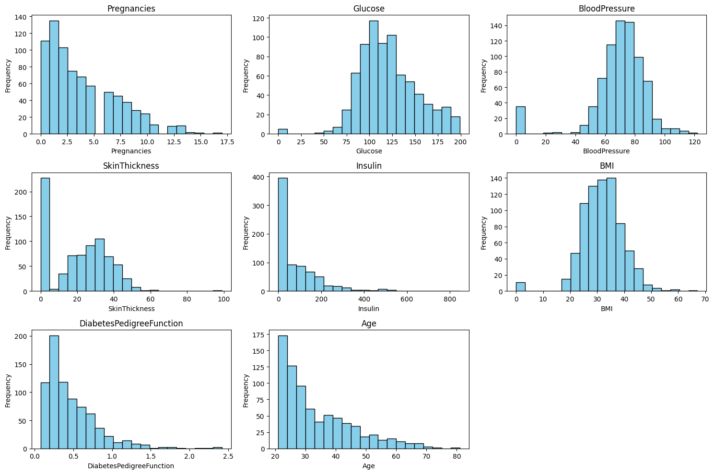

# Laporan Proyek Machine Learning - Rakha Apta Pradhana D R

## Domain Proyek

Diabetes mellitus adalah sekelompok penyakit metabolik kronis yang ditandai dengan kadar glukosa darah tinggi (hiperglikemia) yang berkelanjutan. Kondisi ini timbul akibat kelainan pada sekresi insulin, kerja insulin (resistensi insulin), atau keduanya. Menurut International Diabetes Federation (IDF), pada tahun 2021, diperkirakan 537 juta orang dewasa (20-79 tahun) hidup dengan diabetes di seluruh dunia, dan angka ini diproyeksikan meningkat menjadi 643 juta pada tahun 2030 dan 783 juta pada tahun 2045 [1]. Di Indonesia, Riset Kesehatan Dasar (Riskesdas) 2018 menunjukkan prevalensi diabetes melitus pada penduduk usia ≥15 tahun sebesar 2% [2].

**Mengapa dan Bagaimana Masalah Harus Diselesaikan:**  

Deteksi dini dan diagnosis diabetes yang akurat sangat krusial karena beberapa alasan utama:
1.  **Pencegahan Komplikasi:** Diabetes yang tidak terdiagnosis atau tidak terkontrol dengan baik dapat menyebabkan komplikasi serius jangka panjang, seperti penyakit kardiovaskular (penyakit jantung koroner, stroke), kerusakan saraf (neuropati diabetik), penyakit ginjal kronis (nefropati diabetik) yang dapat berujung pada gagal ginjal, kerusakan mata (retinopati diabetik) yang dapat menyebabkan kebutaan, dan masalah kaki (ulkus diabetik) yang dapat berujung pada amputasi [3]. Intervensi dini melalui perubahan gaya hidup dan/atau pengobatan dapat secara signifikan mengurangi risiko komplikasi ini.  
2.  **Peningkatan Kualitas Hidup:** Manajemen diabetes yang efektif memungkinkan individu untuk menjalani hidup yang lebih sehat dan produktif.  
3.  **Pengurangan Beban Sistem Kesehatan:** Biaya perawatan komplikasi diabetes jauh lebih tinggi dibandingkan biaya pencegahan dan manajemen dini. Deteksi dini dapat mengurangi kebutuhan akan perawatan yang mahal dan kompleks di kemudian hari.  

Masalah ini dapat diselesaikan dengan mengembangkan sistem pendukung keputusan klinis berbasis machine learning. Model machine learning dapat menganalisis pola kompleks dalam data pasien (atribut medis dan gaya hidup) untuk mengidentifikasi individu yang berisiko tinggi menderita diabetes. Sistem seperti ini dapat berfungsi sebagai alat skrining awal yang efisien, membantu tenaga medis memprioritaskan pasien untuk pemeriksaan lebih lanjut dan intervensi preventif.  

**Hasil Riset Terkait atau Referensi:**  

Banyak penelitian telah mengeksplorasi penggunaan machine learning untuk prediksi diabetes. Sebagai contoh:
* Maniruzzaman et al. (2018) mengembangkan model prediksi diabetes menggunakan beberapa algoritma machine learning dan menemukan bahwa Random Forest mencapai akurasi yang tinggi [4].
* Sisodia & Sisodia (2018) melakukan studi perbandingan berbagai algoritma klasifikasi untuk prediksi diabetes dan menyoroti pentingnya pemilihan fitur [5].
* Penelitian lain juga menunjukkan potensi algoritma seperti Support Vector Machines (SVM), Logistic Regression, dan Neural Networks dalam domain ini, seringkali dengan fokus pada peningkatan akurasi dan interpretasi model [6].

Pengembangan model yang tidak hanya akurat tetapi juga memiliki recall yang tinggi untuk kasus positif (mendeteksi penderita diabetes) sangat penting, mengingat konsekuensi dari false negative (pasien diabetes yang terlewat) lebih berat.

## Business Understanding

Proses klarifikasi masalah dalam proyek ini bertujuan untuk mendefinisikan dengan jelas tantangan yang dihadapi dan tujuan yang ingin dicapai melalui pengembangan model machine learning untuk prediksi diabetes.

### Problem Statements
1.  Bagaimana cara mengembangkan model machine learning yang mampu memprediksi secara akurat dan andal kemungkinan seseorang menderita diabetes berdasarkan serangkaian fitur klinis dan demografis yang tersedia, dengan mempertimbangkan tingginya prevalensi dan dampak serius dari diabetes?
2.  Di antara algoritma klasifikasi yang umum digunakan seperti K-Nearest Neighbors (KNN) dan Random Forest, manakah yang menunjukkan performa lebih superior, khususnya dalam hal kemampuan mengidentifikasi kasus diabetes yang sebenarnya (recall tinggi untuk kelas positif), setelah dilakukan proses optimasi hyperparameter untuk dataset yang digunakan?
3.  Bagaimana memastikan model yang dikembangkan dapat diandalkan sebagai alat bantu skrining awal yang efektif, dengan meminimalkan risiko kesalahan diagnosis, terutama kasus false negative (pasien diabetes tidak terdeteksi) yang memiliki konsekuensi kesehatan lebih berat?

### Goals
1.  Membangun dan melatih model klasifikasi menggunakan algoritma K-Nearest Neighbors (KNN) dan Random Forest untuk memprediksi status diabetes berdasarkan dataset yang tersedia.
2.  Melakukan optimasi hyperparameter pada kedua model (KNN dan Random Forest) untuk meningkatkan kinerja prediktifnya, dengan fokus utama pada peningkatan metrik recall untuk kelas positif (mendeteksi penderita diabetes).
3.  Mengevaluasi dan membandingkan secara komprehensif performa kedua model yang telah dioptimasi menggunakan serangkaian metrik evaluasi yang relevan (akurasi, presisi, recall, F1-score, dan analisis confusion matrix), dengan penekanan khusus pada recall untuk kelas positif.
4.  Memilih dan merekomendasikan model terbaik yang paling sesuai untuk aplikasi skrining awal diabetes dalam konteks medis, di mana identifikasi dini kasus positif dan minimalisasi false negative adalah prioritas utama.

### Solution Statement
Untuk mencapai tujuan yang telah ditetapkan, diajukan beberapa pendekatan solusi yang akan dieksplorasi dan dibandingkan, sebagaimana diimplementasikan dalam notebook:

1.  **Solusi A: Pengembangan Model K-Nearest Neighbors (KNN) dengan Optimasi Hyperparameter.**
    * Melatih model KNN pada data yang telah dipersiapkan.
    * Melakukan *hyperparameter tuning* dengan mencoba beberapa kombinasi parameter (misalnya, `n_neighbors`, `weights`, `metric`) dan mengevaluasi metrik `recall` untuk setiap kombinasi guna menemukan yang terbaik.
    * Mengevaluasi performa model KNN yang telah dioptimasi pada data uji.

2.  **Solusi B: Pengembangan Model Random Forest dengan Optimasi Hyperparameter.**
    * Melatih model Random Forest pada data yang telah dipersiapkan.
    * Melakukan *hyperparameter tuning* dengan mencoba beberapa kombinasi parameter (misalnya, `n_estimators`, `max_depth`) dan mengevaluasi metrik `recall` untuk setiap kombinasi guna menemukan yang terbaik.
    * Mengevaluasi performa model Random Forest yang telah dioptimasi pada data uji.

3.  **Pemilihan Solusi Terbaik Berdasarkan Perbandingan Kinerja:**
    * Membandingkan hasil evaluasi dari Solusi A (Tuned KNN) dan Solusi B (Tuned Random Forest) pada data uji, dengan fokus utama pada metrik recall untuk kelas positif (diabetes).
    * Model dengan recall tertinggi untuk kelas positif, serta mempertimbangkan metrik lainnya secara keseluruhan, akan dipilih sebagai solusi akhir.

  Semua solusi ini akan diukur performanya menggunakan metrik evaluasi standar seperti akurasi, presisi, recall, F1-score, dan analisis confusion matrix pada data uji yang independen.  
  
## Data Understanding
Dataset yang digunakan dalam proyek ini adalah Pima Indians Diabetes Database, yang aslinya berasal dari National Institute of Diabetes and Digestive and Kidney Diseases. Tujuan utama dari dataset ini adalah untuk memprediksi secara diagnostik apakah seorang pasien menderita diabetes atau tidak, berdasarkan pengukuran diagnostik tertentu. Terdapat batasan spesifik dalam pemilihan data ini dari database yang lebih besar, yaitu semua pasien adalah wanita berusia minimal 21 tahun dari keturunan Indian Pima(Pima Indian Heritage).

Sumber Data: https://www.kaggle.com/datasets/uciml/pima-indians-diabetes-database

### Variabel-variabel pada dataset:
1. Pregnancies: Jumlah kehamilan
2. Glucose: Kadar glukosa plasma
3. BloodPressure: Tekanan darah diastolik (mm Hg)
4. SkinThickness: Ketebalan lipatan kulit trisep (mm)
5. Insulin: Insulin serum 2-Jam (mu U/ml)
6. BMI: Indeks massa tubuh
7. DiabetesPedigreeFunction: Riwayat diabetes dalam keluarga
8. Age: Usia dalam tahun
9. Outcome: Variabel target (1: diabetes, 0: tidak diabetes)

### Exploratory Data Analysis (EDA):
Proses EDA dilakukan untuk memahami data lebih dalam, termasuk struktur, distribusi, dan hubungan antar variabel.

1. Informasi dan Statistik Deskriptif

- Dataset terdiri dari 768 sampel dan 9 kolom.
- Tidak ditemukan nilai yang hilang (missing values).
- Statistik deskriptif awal menunjukkan adanya nilai 0 yang tidak logis pada beberapa fitur seperti 'Glucose', 'BloodPressure', 'BMI', 'SkinThickness', dan 'Insulin', yang secara medis tidak mungkin terjadi.

2. Analisis Univariate
Analisis distribusi setiap fitur numerik dilakukan menggunakan histogram. Dari visualisasi ini, terlihat bahwa sebagian besar fitur memiliki distribusi yang tidak normal (skewed).

3. Analisis Multivariate (Korelasi Fitur)

Untuk memahami hubungan antar fitur, dibuat heatmap dari matriks korelasi. Hasilnya menunjukkan korelasi positif yang cukup kuat antara 'Glucose', 'BMI', dan 'Age' dengan variabel target 'Outcome'.

[Gambar Heatmap Korelasi]

4. Distribusi Variabel Target

Visualisasi distribusi variabel 'Outcome' menunjukkan bahwa dataset tidak seimbang (imbalanced), dengan jumlah kasus non-diabetes (0) lebih banyak daripada kasus diabetes (1). Hal ini penting untuk diperhatikan karena dapat mempengaruhi performa dan evaluasi model.

[Gambar Distribusi Variabel Outcome]

## Data Preparation  
1. Data Cleaning/Pembersihan Data (Handling Zero Values):
   - Nilai 0 yang tidak logis pada kolom 'Glucose', 'BloodPressure', 'BMI', 'SkinThickness', dan 'Insulin' diganti dengan nilai median dari masing-masing kolom. Penggunaan median lebih robust terhadap outlier dibandingkan mean. 
2. Pembagian Data (Data Splitting):
   - Data dibagi menjadi data latih (80%) dan data uji (20%).
   - Menggunakan stratified split berdasarkan kolom 'Outcome' untuk memastikan proporsi kelas target (diabetes vs. non-diabetes) tetap sama di kedua set data, yang penting untuk data tidak seimbang.  
3. Standardisasi Fitur (Feature Scaling):
   - Menggunakan StandardScaler dari pustaka Scikit-learn untuk menormalkan fitur numerik.
   - Fitur diubah skalanya agar memiliki distribusi dengan mean=0 dan variance=1. Langkah ini krusial untuk algoritma yang sensitif terhadap skala seperti KNN.
   - Proses scaling diterapkan pada data latih dan uji secara terpisah untuk mencegah kebocoran data (data leakage).  

## Modeling
Dua model machine learning digunakan dalam proyek ini:

1. K-Nearest Neighbors (KNN):
   - Menggunakan k=3 nearest neighbors
   - Kelebihan: Sederhana, mudah diimplementasikan
   - Kekurangan: Sensitif terhadap skala fitur, komputasi berat untuk dataset besar

2. Random Forest:
   - Menggunakan 100 trees dengan max_depth=15
   - Kelebihan: Robust terhadap overfitting, dapat menangani fitur non-linear
   - Kekurangan: Memerlukan lebih banyak memori, kurang interpretable

## Evaluation
Evaluasi model menggunakan beberapa metrik:
- Confusion Matrix
- Classification Report (Accuracy, Precision, Recall, F1-Score)

Kedua model menunjukkan performa yang baik, dengan Random Forest sedikit lebih unggul dalam hal akurasi dan recall untuk kelas positif (diabetes).

## Conclusion
- Random Forest menunjukkan performa yang lebih baik dalam prediksi diabetes
- Standardisasi fitur sangat penting untuk performa model KNN
- Model dapat digunakan sebagai alat screening awal untuk risiko diabetes, tetapi tidak menggantikan diagnosis medis profesional

## Referensi
[1] International Diabetes Federation. *IDF Diabetes Atlas, 10th edn.* Brussels, Belgium: 2021. Tersedia: (https://www.diabetesatlas.org)  
[2] Kementerian Kesehatan Republik Indonesia. *Laporan Nasional Riskesdas 2018.* Jakarta: Lembaga Penerbit Badan Penelitian dan Pengembangan Kesehatan, 2019.  
[3] American Diabetes Association. "Standards of Medical Care in Diabetes—2023." *Diabetes Care*, vol. 46, Supplement 1, 2023.  
[4] Maniruzzaman, M., Rahman, M. J., Al-MehediHasan, M., Suri, H. S., Abedin, M. M., El-Baz, A., ... & Suri, J. S. (2018). "Accurate diabetes risk stratification using machine learning: role of missing value and outliers." *Journal of medical systems*, 42(5), 1-15.  
[5] Sisodia, D., & Sisodia, D. S. (2018). "Prediction of diabetes using classification algorithms." *Procedia computer science*, 132, 1578-1585.  
